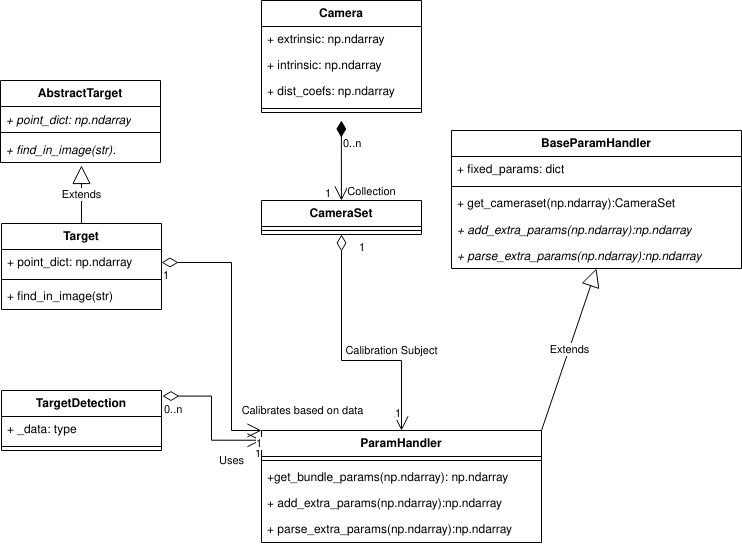

# Architecture

A calibration in pyCamSet is four things talking to each other: a **target**
that knows what it looks like and how to find itself in an image, a
**detection** that records where it was found, a **parameter handler** that
turns an array of numbers into the geometry of a problem, and a **loss**
composed from small differentiable blocks. `calibrate_cameras` is the
arrangement of those four that covers the common case.

---

## The path an image takes

**1. Detection.** Every image is handed to the target's `find_in_image`, which
returns an `ImageDetection` — the features it recognised and where they were.
Across a whole session those accumulate into a
[`TargetDetection`][pyCamSet.calibration_targets.core.target_detections.TargetDetection],
which is the observation set everything downstream is solved against.

**2. Initial calibration.** Each camera is calibrated independently from those
detections, through OpenCV, giving a first estimate of every camera's
intrinsics, distortion and pose. This is what the joint solve starts from, and
a joint solve started from somewhere bad may not recover.

**3. Parameter handling.** A
[`TemplateBundleHandler`][pyCamSet.optimisation.template_handler.TemplateBundleHandler]
takes the camera set, the target and the detections, and defines the
optimisation: which numbers are free, what shape they are in, and how to turn a
flat parameter vector back into cameras and target poses. It is also where the
gauge is fixed — some camera and some pose have to be held, or the whole scene
can drift without changing a single reprojection.

**4. Bundle adjustment.** `run_bundle_adjustment` compiles the loss, hands it to
the solver, and returns the optimisation result together with the `CameraSet`
that minimises it.

---

## Where the seams are

Each of those steps is a class you can replace, and the three that are meant to
be replaced have a page of their own:

| Seam | Replace it to | |
|---|---|---|
| [`AbstractTarget`](extending/targets.md) | Calibrate against a shape pyCamSet does not ship | Define where the features are, and how to find them |
| [Parameter handler](extending/parameters.md) | Add parameters, or constrain existing ones | Two hooks: `add_extra_params`, `parse_extra_params_and_setup` |
| [Function blocks](extending/bundle-adjustment.md) | Change what the loss actually measures | Compose the projection chain from differentiable pieces |

Substituting a derivative of any of these into the framework is what allows the
calibration target, the calibration method, and the type of optimisation to be
customised independently of each other.

## Why the loss is composed rather than written

The bundle adjustment loss is not written out as a single cost function. It is
*composed* from small pieces called function blocks, in the style of
ceres-solver — each block declaring what it consumes, what it produces, what
parameters it owns, and supplying both a numba kernel that computes its output
and one that computes its own derivative.

Chaining the blocks gives the loss; chaining their derivatives by the chain rule
gives an **analytic** jacobian. From that chain pyCamSet generates the source of
a single fused loss kernel and a single fused jacobian kernel, caches them on
disk, and imports them back — so a problem of a given shape is compiled the
first time it is solved and reused thereafter.

That is the reason a new formulation is a change of a few lines rather than a
new derivation: swapping one block for another produces a different loss and a
correct jacobian for it, without touching the optimiser.

## Fixed geometry, and free

The difference between a normal calibration and
[self-calibration](how-to/self-calibration.md) is one block. `template_points`
reads the target's feature coordinates as a given; `free_point` makes each one a
parameter the solver moves. `TemplateBundleHandler` uses the first,
`SelfBundleHandler` the second, and everything else about the two problems is
the same.
