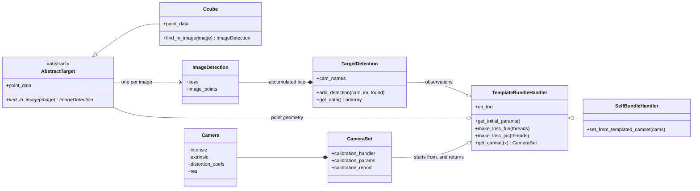
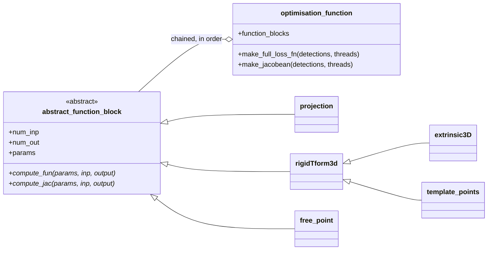

# Architecture

A calibration in pyCamSet is four things talking to each other: a **target**
that knows what it looks like and how to find itself in an image, a
**detection** that records where it was found, a **parameter handler** that
turns an array of numbers into the geometry of a problem, and a **loss**
composed from small differentiable blocks. `calibrate_cameras` is the
arrangement of those four that covers the common case.

<figure class="class-diagram" markdown>



<figcaption markdown>
What a calibration is made of.  The handler is given the other three and
defines the problem; the target and the handler are two of the three seams a
class of your own substitutes into.
</figcaption>

</figure>

---

## The Abstract Path


### 1. Detection

Every image is handed to the target's `find_in_image`, which returns an
[`ImageDetection`][pyCamSet.calibration_targets.core.target_detections.ImageDetection]:
the features it recognised, as the key identifying each one and the pixel it
was found at.

```python exec="true" source="above" result="text" log="no" session="architecture"
from pathlib import Path

import cv2
from cv2 import aruco

from pyCamSet import Ccube

corpus = Path("tests/test_data/calibration_ccube")
target = Ccube(
    n_points=10, length=40, aruco_dict=aruco.DICT_6X6_1000, border_fraction=0.2)

found = target.find_in_image(cv2.imread(str(corpus / "cam0" / "0.jpg")))
print(f"{found.data_len} features in this one image")
print(f"the first is key {found.keys[0]}, found at pixel {found.image_points[0]}")
```

Across a session those accumulate into a
[`TargetDetection`][pyCamSet.calibration_targets.core.target_detections.TargetDetection]
— one row per observation, holding which camera, which image, which feature,
and where. That array is the observation set everything downstream is solved
against:

```python exec="true" source="above" result="text" log="no" session="architecture"
from pyCamSet.calibration.camera_calibrator import detect_datapoints_in_imfile

detection, resolutions = detect_datapoints_in_imfile(corpus, target)
data = detection.get_data()

print(f"{data.shape[0]} observations, of {len(detection.cam_names)} cameras")
print("[camera, image, key, key, x, y]")
print(data[0])
```

### 2. Initial calibration

Each camera is calibrated independently from those detections, through
OpenCV, giving a first estimate of every camera's intrinsics and distortion.

```python exec="true" source="above" result="text" log="no" session="architecture"
from pyCamSet.calibration.camera_calibrator import run_initial_calibration

initial = run_initial_calibration(detection, target, resolutions, save=False)

for camera in initial:
    focal, centre = camera.intrinsic[0, 0], camera.intrinsic[:2, 2]
    print(f"{camera.name}  focal {focal:8.1f} px   principal point {centre}")
```

### 3. Parameter handling

A [`TemplateBundleHandler`][pyCamSet.optimisation.template_handler.TemplateBundleHandler]
takes the camera set, the target and the detections, and defines the
optimisation: which numbers are free, what shape they are in, and how to turn a
flat parameter vector back into cameras and target poses. It is also where the global coordinate
is fixed. By default, this is defined as the position of the first calibration target.

```python exec="true" source="above" result="text" log="no" session="architecture"
import numpy as np

from pyCamSet.optimisation.template_handler import TemplateBundleHandler

handler = TemplateBundleHandler(
    detection=detection, target=target, camset=initial)

for group in handler.parameter_groups():
    held = np.size(group.base) - int(np.sum(group.element_unfixed))
    print(f"{group.name:<5} {str(np.shape(group.base)):<9}"
          f" {int(np.sum(group.element_unfixed)):4d} free, {held} held")

print(f"{handler.get_initial_params().size} numbers the solver moves")
```

### 4. Bundle adjustment

`run_bundle_adjustment` compiles the loss, hands it to the solver, and returns
the optimisation result together with the `CameraSet` that minimises it. The
result is two residuals per observation — the x and the y of each
reprojection:

```python exec="true" source="above" result="text" log="no" session="architecture"
from pyCamSet.optimisation.optimisation_handling import run_bundle_adjustment

optimisation, cams = run_bundle_adjustment(handler)

print(f"{optimisation.fun.size} residuals, for {data.shape[0]} observations")
print(f"mean reprojection error {cams.calibration_report.mean_px:.2f} px")
```

`calibrate_cameras` is those four calls, with the caching, the reports and the
checks around them.

---

## Where the seams are

Each of those steps is a class you can replace, and the three that are meant to
be replaced have a page of their own. Each is also already replaced once inside
the library, which is the concrete version of what a replacement looks like:

| Seam | Replace it to | Replaced in the library by |
|---|---|---|
| [`AbstractTarget`](extending/targets.md) | Calibrate against a shape pyCamSet does not ship | `Ccube` — six ChArUco boards, held on a cube |
| [Parameter handler](extending/parameters.md) | Change what the optimisation is free to move | `SelfBundleHandler` — the target's own points, freed |
| [Function blocks](extending/bundle-adjustment.md) | Change what the loss actually measures | `free_point` — a feature that is a parameter |

What each of those actually had to write, read back out of the classes as this
page is built:

```python exec="true" source="above" result="text" session="architecture"
import inspect

from pyCamSet.calibration_targets.core.abstract_target import AbstractTarget
from pyCamSet.optimisation.abstract_function_blocks import abstract_function_block
from pyCamSet.optimisation.standard_bundle_handler import SelfBundleHandler
from pyCamSet.optimisation.template_handler import TemplateBundleHandler

print("a target defines point_data, and")
print(f"    find_in_image{inspect.signature(AbstractTarget.find_in_image)}")

print("\na parameter handler overrides")
for name in sorted(vars(SelfBundleHandler)):
    member = getattr(SelfBundleHandler, name)
    if not name.startswith("_") and hasattr(TemplateBundleHandler, name):
        print(f"    {name}{inspect.signature(member)}")

print("\na function block declares num_inp, num_out and params, and defines")
for name in ("compute_fun", "compute_jac"):
    print(f"    {name}{inspect.signature(getattr(abstract_function_block, name))}")
```

Substituting a derivative of any of these into the framework is what allows the
calibration target, the calibration method, and the type of optimisation to be
customised independently of each other.

---

## Why the loss is composed rather than written

The bundle adjustment loss is not written out as a single cost function. It is
*composed* from small pieces called function blocks, in the style of
ceres-solver — each block declaring what it consumes, what it produces, what
parameters it owns, and supplying both a numba kernel that computes its output
and one that computes its own derivative.

Chaining the blocks gives the loss; chaining their derivatives by the chain rule
gives an **analytic** jacobian. From that chain pyCamSet generates the source of
a single fused loss kernel and a single fused jacobian kernel, caches them on
disk, and imports them back — so a problem of a given shape is compiled the
first time it is solved and reused thereafter.

That is the reason a new formulation is a change of a few lines rather than a
new derivation: swapping one block for another produces a different loss and a
correct jacobian for it, without touching the optimiser.

<figure class="class-diagram" markdown>



<figcaption markdown>
The loss, as classes.  `projection() + extrinsic3D() + template_points()` is
the chain a `TemplateBundleHandler` solves; the blocks are the third seam.
</figcaption>

</figure>

---

## Fixed and free geometry.

The difference between a normal calibration and
[freeing the target's geometry](how-to/calibrate.md#stage-5-freeing-the-targets-geometry) is one block. `template_points`
reads the target's feature coordinates as a given; `free_point` makes each one a
parameter the solver moves. `TemplateBundleHandler` uses the first,
`SelfBundleHandler` the second, and everything else about the two problems is
the same.
