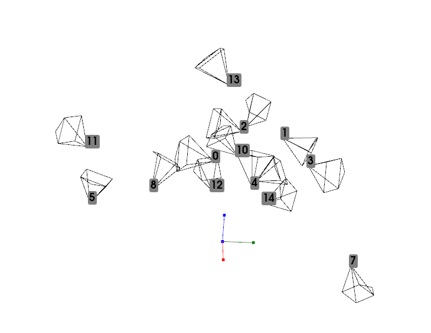

================================================================================
Camera Set Example
================================================================================

This provides more detail on the runnable example of camera_set_example.py

Creating a Set of Cameras
=========================

Camera sets are created from lists of inputs.
This is a list of camera names, a list of extrinsic matrices, and a list of
intrinsic calibrations if the default is not necessary.
The following code creates 15 random cameras, initialises an empty camera set
and then loads the random cameras into the set.

::

    # generate n random cameras
    n_cam = 15

    names = [str(n) for n in range(n_cam)]

    #generate random extrinsic positions, and use the default camera arrangement
    extrinsic = [e_4x4(np.random.rand(3)*np.pi,
                       np.random.rand(3)*0.2)
                 for _ in range(n_cam)]

    #A list of a standard calibration
    intrinsic = [np.array([[1000, 0, 480],
                           [0, 1000, 320],
                           [0,    0,   1]]
                          )
                 ] * n_cam

    #the camera set can be instantiated with cameras, or provided with
    # details later via the set_cams interface
    test_cameras = CameraSet(plot_cams=False)

    #the plot cams option disables automatic visualisation of the cameras on
    # setting the cameras within the set.

    test_cameras.set_cams(camera_names=names,
                          extrinsic_matrices=extrinsic,
                          calibration_matrixes=intrinsic,
                          res=[640, 940])

This code will likely raise a Critical logging warning. As the cameras are
random, they will not share a central viewing point, triggering a sanity check
on the input.

In addition, this code disables the default behaviour of visualising the camera
set after import.

Camera Set Visualisation
========================

By default the camera sets are visualised to check for import errors.
This visualisation can be called at any point with the following code.

::

    test_cameras.plot()

Visualising the randomly generated set of cameras gives the following result:

