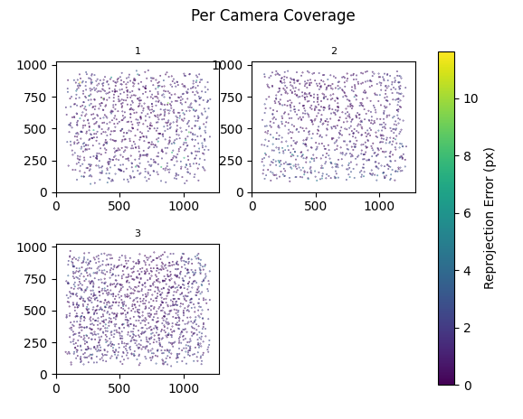
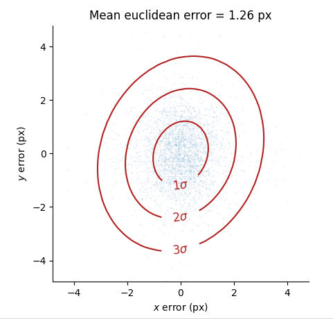
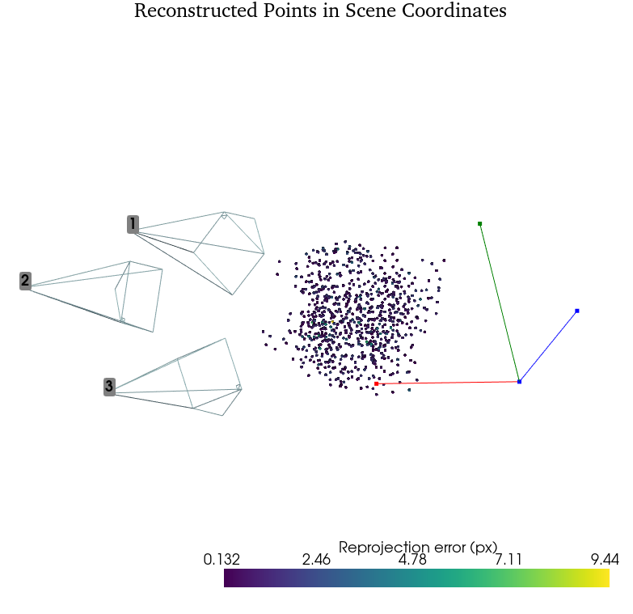
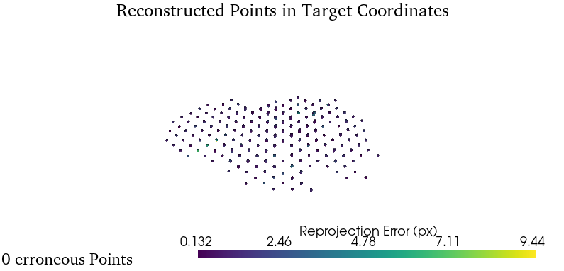
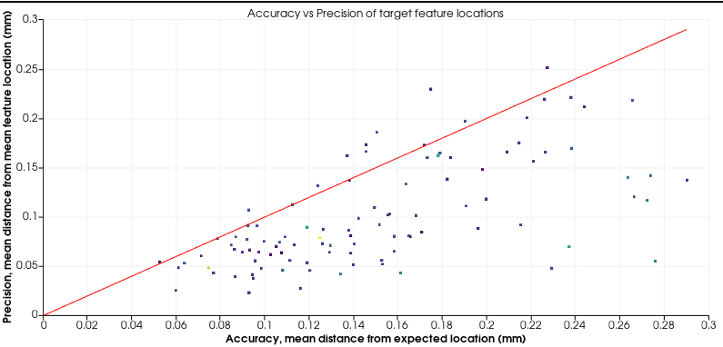

========================================
Calibration
========================================

The library provides a single main class for calibrating a set of cameras.
Easy calibration of an arbitrary camera system is a main goal of the library.

When called, this class takes a calibration target, the location of the associated images, and returns a CameraSet object.
To use this class, the data for the calibration should be in the following tree structure.

Calibration Example
===================

To calibrate a camera system with this library, the first step is to create a calibration target, and take images of the target with the camera system.
This should be placed into the example tree structure.

This can then be passed to the calibrator class, along with the class representing the calibration target that was used to make the images.

::

   from pathlib import Path
   from pyCamSet import CameraCalibrator, ChArUco

   calibration_data = Path('my/calibration/path')
   calibration_target = ChArUco(num_squares_x=10, num_squares_y=10, square_size=4):

   calibrator = CameraCalibrator()
   cams = calibrator(f_loc=calibration_data, calibration_target=calibration_target, draw=True)

Understanding Calibration Metrics
=================================

If a calibration is visualised, with the CameraSet().visualise_calibration() method, there are several plots created.
The first plots are 2D plots, which look at error in image space.
This is the domain over which the bundle adjustment loss is calculated.

The first image looks at the coverage of calibration data over the sensors of the cameras.
This will highlight if the calibration was too localised.
If a region of a camera sensor does not have data, it is not calibrated.

The second plot displays the Euclidean reprojection error achieved, and the distribution of the errors as the relative distance from the true detection.

The second set of plots are 3D plots.
These plots display 3D information that is recovered from the detections with the calbration.

The first plot displays the least squares triangulation of all triangulatable information in world coordinates.
This can give a feel for if the calibration will perform well with later triangulation tasks.

The second plot shows the triangulations displayed in object coordinates.
Ideally, this looks like the internal point_data structure.
However, if there are uncertainties in the location of the object, or other systematic defects this will result in noticable noise in the reconstructed surface.
The line tracking the number of erroneous points indicates how many points were found that lay very far from the correct location.
Some deductions about the cause of the systematic error can be made from this plot.
As an example, if there is low spread in the local x,y coordinates, but a lot of spread in the z, this indicates that the camera system was insensitive to the z direction.
This could be because the effective baseline of the calibrated system is too small.

The final plot aims to detect defects in the calibration target.
If the distance from the mean of a cluster of key point detections to the expected location (accuracy) is greater than the standard deviation of the cluster (precision), this likely indicates a manufacturing defect in the calibration target.

Fixed Parameter Calibrations
============================

Some camera sytems have fixed parameters, and cannot be calibrated traditionally.
This is typically seen when depth cameras are being used in a mixed camera system.

This is represented by creating a fixed parameter array, and passing it to the calibrator.

::

   from pathlib import Path
   from pyCamSet import CameraCalibrator, ChArUco

   calibration_data = Path('my/calibration/path')
   calibration_target = ChArUco(num_squares_x=10, num_squares_y=10, square_size=4):

   fixed_params = {
      "cam0" = {"dst":[0,0,0,0,0]},
      "cam4" = {"int":[[1000, 0, 320], [0, 1001, 240], [0, 0, 01]},
   }

   calibrator = CameraCalibrator()
   cams = calibrator(f_loc=calibration_data, calibration_target=calibration_target,
      fixed_params=fixed_params, draw=True)

The above code creates the fixed_params dictionary, which fixes the distortion of the camera named "cam0" to be zero, and fixes the intrinsic matrix of "cam4".
The accepted fixed_param keys are "dst", "ext", and "int" which represent the distortion, extrinsic and intrinsic matrixes respectively.
Fixing extrinsics should be used with care, as this will rapidly overconstrain the optimisation.

Any camera or camera parameter not in this dictionary will be optimised as usual.

Optimisation Methods
====================================

.. toctree::
   :maxdepth: 2
   :caption: Contents:

   detections
   optimisation

